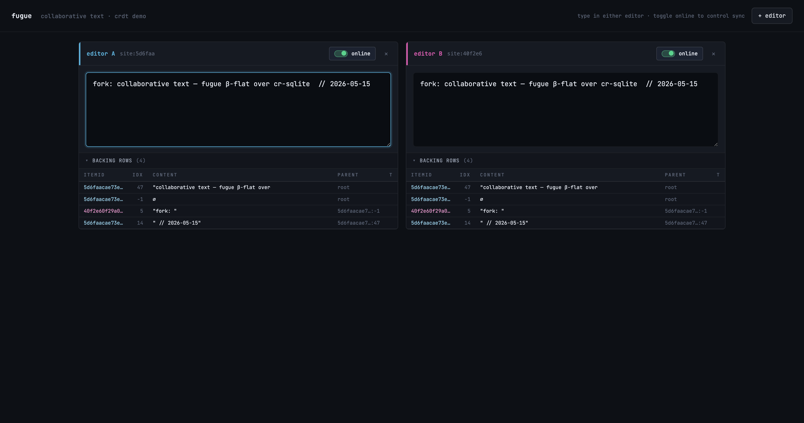
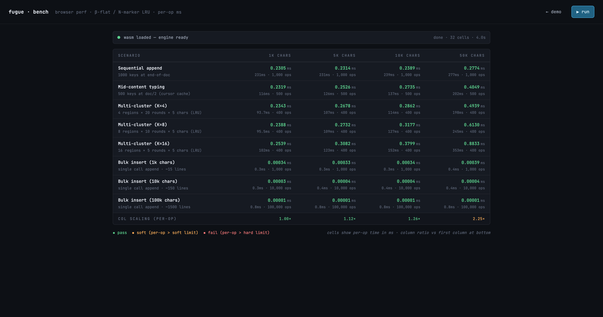

# cr-sqlite · Fugue text-CRDT fork

A fork of [vlcn-io/cr-sqlite](https://github.com/vlcn-io/cr-sqlite) that
adds a Fugue-based text CRDT on top of the existing column-LWW substrate,
shipped as a portable WASM extension with a browser demo + benchmark page.

For the upstream project's positioning, examples, and broader CRDT story
see [`old_readme.md`](./old_readme.md).



## What this fork adds

- **`crsql_as_text_crdt(table, column)`** — promote any TEXT column into a
  Fugue-ordered character CRDT. Backing rows live in a sibling table the
  extension manages; the parent column stays a materialised view kept in
  sync by triggers.
- **β-flat architecture** — each insertion is one backing row with content
  + parent pointer. No mid-run splits, no compound items, no overlap
  cleanup pass at sync time. Concurrent inserts at the same position
  produce siblings and Fugue ordering converges them deterministically.
- **Any single-column primary key** — INTEGER, TEXT, or BLOB. The engine
  canonicalises whatever value the caller passes into a tag-prefixed
  byte form for internal use, and the render trigger resolves the
  parent's PK column from `pragma_table_info` rather than assuming
  `rowid`. Compound (multi-column) PKs are rejected at registration
  with a clear error.
- **Insertion cache (N-marker LRU)** — Yjs-style `ArraySearchMarker`
  ported into the engine. Sequential typing, mid-content typing, and
  jumping between multiple cursor regions all stay flat-per-op as the
  document grows.
- **Portable WASM build** — `make wasm` clones the right wa-sqlite, pins
  the commit, symlinks our core, builds, copies into `web/vendor/`.
- **Browser demo + bench page** — multi-peer collaborative text editor
  with live sync, plus a matrix benchmark page for measuring per-op and
  bulk-insert timing in-browser.
- **TLA+ spec** — formal model of the atomic-row protocol in
  [`spec/`](./spec/), verified with TLC.

## Building

### Native loadable extension

Requires Rust nightly (auto-installed via `rust-toolchain.toml`) and the
SQLite headers.

```sh
make            # builds core/dist/crsqlite.{so,dylib}
make clean
```

### WASM (browser)

Requires `emcc` (Emscripten) and `rustup` on PATH:

```sh
brew install emscripten     # macOS; equivalent on Linux
make wasm                   # outputs web/vendor/crsqlite.{wasm,mjs}
make wasm-clean             # blow away .build-cache/wa-sqlite
```

First run takes ~3 minutes (clones wa-sqlite, builds sqlite-amalgamation,
links the WASM bundle). Subsequent runs reuse the cache.

## Running

### Demo (multi-peer text editor)

```sh
cd web
pnpm install
node serve.mjs              # serves on http://localhost:8787
```

Two editors load by default; type in either, they sync. Toggle peers
offline to force divergence, toggle back online to watch convergence.
Open the `backing rows` disclosure to see the Fugue tree.

### Benchmark page (in-browser)

Same server, navigate to `http://localhost:8787/bench.html`. Click `run`
once — a 32-cell matrix fills in over ~5s covering append, mid-content
typing, multi-cluster typing (K ∈ {4, 8, 16}), and single-call bulk
inserts (1k / 10k / 100k chars).



### Test suites

```sh
# Property-based fuzz: 200 random multi-peer scenarios + final-convergence check
node tests/smoke/text-crdt-fuzz.mjs
ITER=2000 node tests/smoke/text-crdt-fuzz.mjs    # extended run

# Targeted regression smoke tests
node tests/smoke/text-crdt-phase1.mjs            # local invariants
node tests/smoke/text-crdt-phase2.mjs            # two-node sync
node tests/smoke/text-crdt-phase7-sync.mjs       # offline/online + sync
```

## Performance notes

Numbers from `bench.html` on Apple Silicon (asyncify adds overhead vs
the loadable-extension build).

**Interactive typing** — per-op stays within a tight band across doc
size, confirming the cache is doing its job:

| scenario              | 1k       | 5k       | 10k      | 50k      |
|----------------------|----------|----------|----------|----------|
| Sequential append    | 0.24ms   | 0.25ms   | 0.27ms   | 0.30ms   |
| Mid-content typing   | 0.25ms   | 0.29ms   | 0.30ms   | 0.48ms   |
| Multi-cluster (K=16) | 0.31ms   | 0.37ms   | 0.41ms   | 1.04ms   |

**Bulk insert (single UDF call)** — the agent-edit workload. Per-call
total time, doc size = host before insert:

| block size  | 1k doc | 5k     | 10k    | 50k    |
|-------------|--------|--------|--------|--------|
| 1k chars    | 0.4ms  | 0.4ms  | 0.4ms  | 0.4ms  |
| 10k chars   | 0.4ms  | 0.4ms  | 0.4ms  | 0.5ms  |
| 100k chars  | 0.8ms  | 0.9ms  | 0.9ms  | 3.3ms  |

A 100k-char block (~1500 lines) inserted into a 50k-char host takes
3.3ms — comfortably under a frame budget. The same workload as
individual char inserts would round-trip through asyncify per-char and
cost ~25 seconds.

## Repo layout

```
core/                       cr-sqlite C + Rust core (vendored from upstream)
core/rs/text-crdt-fugue/    Fugue layer — insertion, deletion, cache, render
spec/                       TLA+ specification of the atomic-row protocol
tests/smoke/                Node smoke tests + property fuzz
tests/browser/              Playwright browser smoke tests
web/                        Browser demo (index.html) + bench (bench.html)
web/vendor/                 Built WASM artefacts (crsqlite.wasm + custom loader)
Makefile                    `make` (native), `make wasm` (browser bundle)
```

## Status

Treated as a working fork, not a release. Key invariants are property-
fuzz-checked across thousands of random multi-peer scenarios; the
TLA+ model also verifies them at small scale. Some history worth
knowing if you're reading the code:

- The β-split-era `crsql_fugue_cleanup` UDF was retired entirely — β-flat
  produces each char as its own row with a unique itemId, so the
  concurrent-split overlap that cleanup trimmed simply can't form.
- The render walker is iterative, not recursive — β-flat documents form
  a linear chain (each char's parent is the previous char), so an N-char
  doc would otherwise blow the native thread stack around N≈100k.
- Sentinel rows (`idx == -1`) from Case-3 insertion logic still exist
  and the render walker steps through them; they carry no own content.

## License

MIT (inherited from upstream cr-sqlite).
